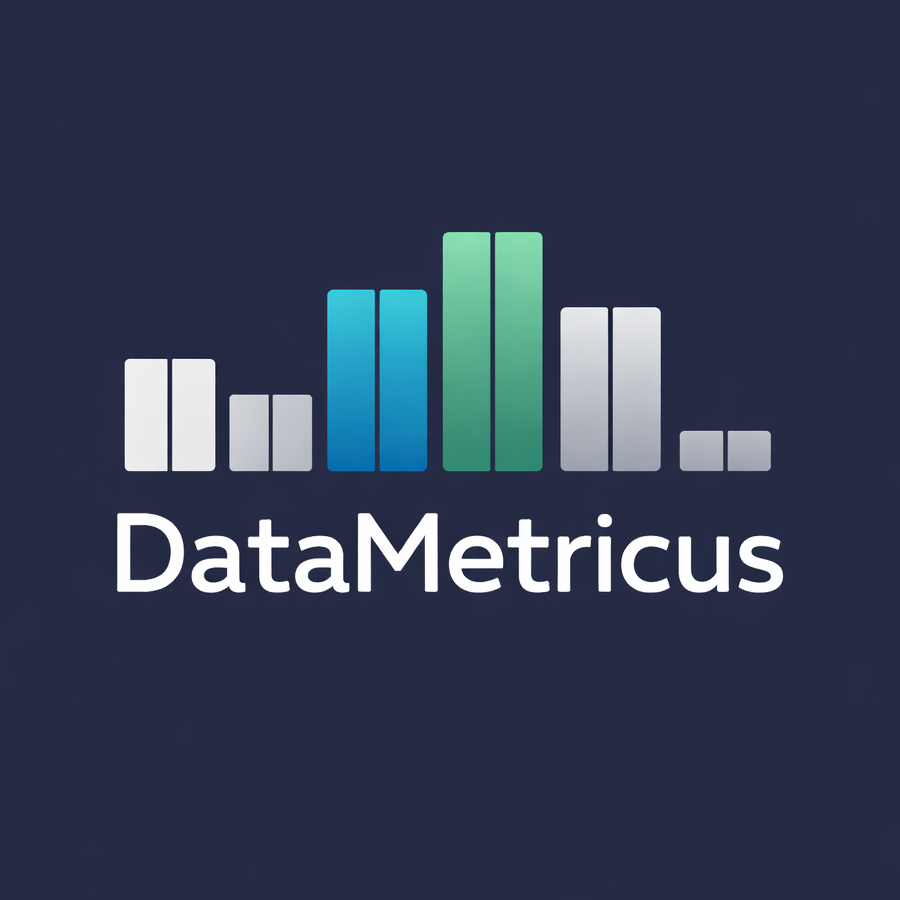

  

 

# DataMetricus

Data-driven strategy data visualization and quantitative modelling.

**DataMetricus** is an independent advisory and training initiative focused on statistical modelling, health metrics, actuarial analysis, and reproducible research.

The aim is simple: translate complex data into structured, defensible decisions — and build the analytical capability to sustain that work internally.

**Focus Areas**

	•	Statistical and actuarial modelling
	•	Health metrics and applied epidemiology
	•	Reproducible research workflows (R, Python, Git)
	•	Professional training in quantitative methods

**Status**

DataMetricus is currently in its early development phase.
Projects, case studies, and structured toolkits will be published here progressively.
